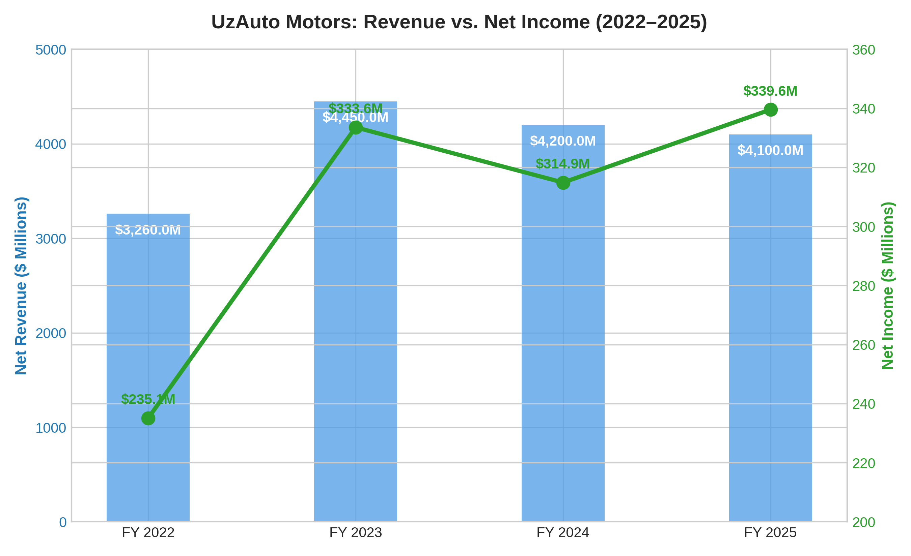
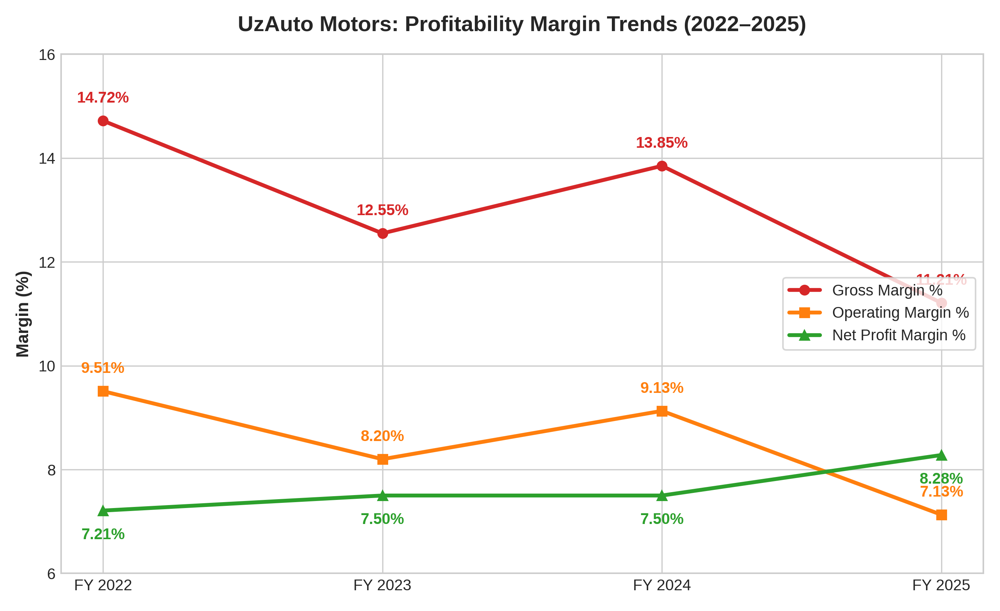
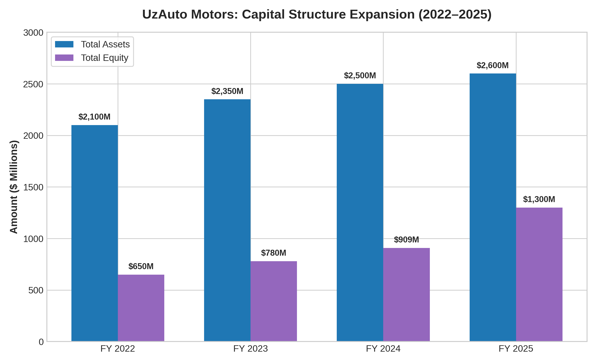

# UzAuto Motors Financial Performance Analysis (2022–2025)

An exploratory financial case study evaluating revenue trends, core operating margin compression, and capital structure expansion for UzAuto Motors JSC across a **$4.1B+ revenue base**.

---

## 📊 Key Project Highlights
* **Dataset Scope:** Analyzed **4 years** (FY 2022–FY 2025) of corporate financial statements spanning **~$16B in cumulative revenue**.
* **Revenue Peak:** Top-line revenue surged **+36.5%** from $3,260.0M (2022) to a peak of $4,450.0M (2023) before stabilizing at $4,100.0M (2025).
* **Margin Compression:** Identified a **-351 bps drop** in Gross Margin (14.72% → 11.21%) and a **-238 bps drop** in Operating Margin (9.51% → 7.13%).
* **Capital Shift:** Detected a **+100% expansion in Total Equity** ($650M → $1,300M), causing ROE compression from **36.17% to 26.12%**.

---

## 📈 Financial & Margin Analysis

### Financial Summary ($ Millions)
| Metric | FY 2022 | FY 2023 | FY 2024 | FY 2025 | 4-Yr Change |
| :--- | :---: | :---: | :---: | :---: | :---: |
| **Net Revenue** | $3,260.0 | $4,450.0 | $4,200.0 | $4,100.0 | **+25.8%** |
| **Gross Profit** | $480.0 | $558.5 | $581.7 | $459.6 | **-4.3%** |
| **Operating Profit** | $310.0 | $364.9 | $383.5 | $292.3 | **-5.7%** |
| **Net Income** | $235.1 | $333.6 | $314.9 | $339.6 | **+44.4%** |
| **Total Equity** | $650.0 | $780.0 | $908.8 | $1,300.0 | **+100.0%** |

### Efficiency Ratios (%)
| Financial Ratio | FY 2022 | FY 2023 | FY 2024 | FY 2025 | Trend |
| :--- | :---: | :---: | :---: | :---: | :---: |
| **Gross Margin %** | 14.72% | 12.55% | 13.85% | 11.21% | 🔻 -351 bps |
| **Operating Margin %** | 9.51% | 8.20% | 9.13% | 7.13% | 🔻 -238 bps |
| **Net Profit Margin %** | 7.21% | 7.50% | 7.50% | 8.28% | 🔺 +107 bps |
| **Return on Equity (ROE)** | 36.17% | 42.77% | 34.65% | 26.12% | 🔻 -1005 bps |

---

## 🛠 Technical Methodology
* **Data Processing:** Cleaned and structured raw corporate disclosures using `Pandas` and `NumPy`.
* **Financial Modeling:** Calculated core operational margins, asset turnover, and debt-to-equity ratios.
* **Visualization:** Rendered publication-ready financial trend plots using `Matplotlib`.

### Visualizations

---

## 🎯 Strategic Takeaways
1. **COGS Control:** Direct manufacturing costs grew faster than top-line revenue, eroding gross margins by 3.5%.
2. **Capital Efficiency:** Deploy the $1,300M enlarged equity base into localized supply chains and EV production to reverse the ROE drop.

---

## 📂 Repository Structure
* `financial_analysis.py` – Python script for data processing and chart generation.
* `uzauto_financials_2022_2025.xlsx` – Processed financial dataset.
* `chart1_revenue_vs_net_income.png` – Top-line vs net profit trend chart.
* `chart2_margin_trends.png` – Multi-line operational margin visualization.
* `chart3_capital_structure.png` – Asset and equity growth chart.
